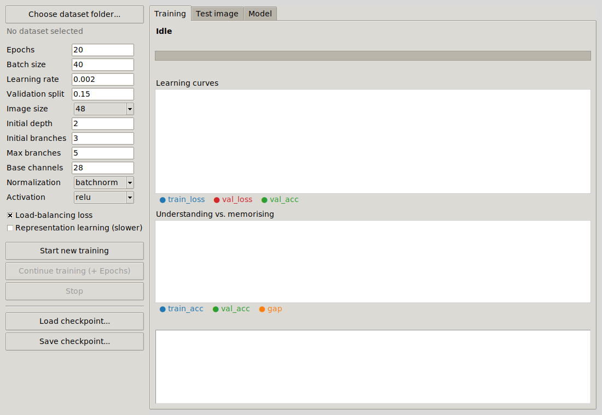
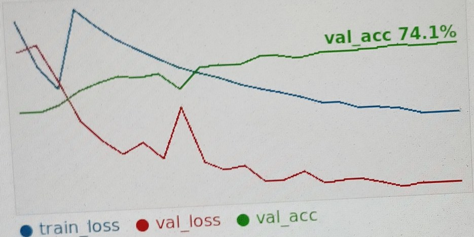
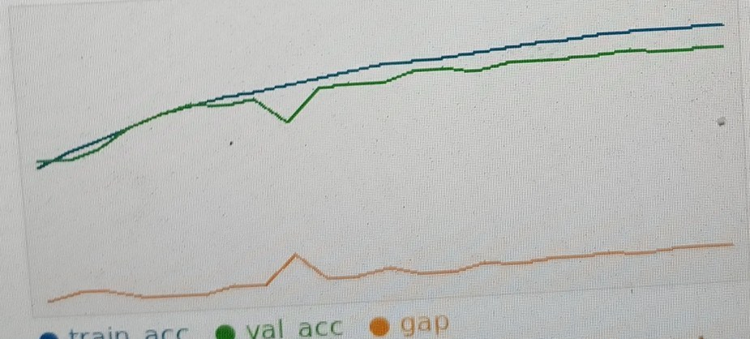

# AFNN - Adaptive Fractal Neural Network

**A neural-network architecture whose structure is fractal, learned, and able to grow
while it trains.**

AFNN is primarily an **architecture experiment**: the goal is to test whether a
self-similar, recursively constructed **fractal neural-network architecture** can learn
useful visual representations and adapt its capacity while training.

The central question is not simply "can it classify images?" It is:

> **Can a fractal structure, with learned branch combinations and controlled growth,
> learn and generalize from visual data without relying on a large, fixed architecture
> designed in advance?**

A real image-classification dataset is used as the experimental test bench. The
classification task is therefore a means of evaluating the architecture, while the main
research interest is the behavior of the fractal structure itself: learning, growth,
representation formation, and generalization.

Maker: **Ahmed Al-Amin** - ahmedahmedalmin23@gmail.com



---

## Contents

1. [Why this project exists](#1-why-this-project-exists)
2. [Background: ordinary networks, fractals, fractal networks](#2-background-ordinary-networks-fractals-fractal-networks)
3. [The AFNN architecture](#3-the-afnn-architecture)
4. [How AFNN differs from other networks, and what this experiment shows](#4-how-afnn-differs-from-other-networks-and-what-this-experiment-shows)
5. [Project layout](#5-project-layout)
6. [Installation](#6-installation)
7. [Dataset format](#7-dataset-format)
8. [Usage](#8-usage)
9. [The experiment: training run and results](#9-the-experiment-training-run-and-results)
10. [Hardware and why training was slow](#10-hardware-and-why-training-was-slow)
11. [Problems met and how they were solved](#11-problems-met-and-how-they-were-solved)
12. [Code map, tests, license](#12-code-map-tests-license)

---

## 1. Why this project exists

Most deep-learning work starts with a task (recognise pictures, translate text) and
picks an architecture that is already known to work. AFNN goes the other way round: the
**architecture is the goal**. The design targets three limitations of ordinary networks:

1. **The size is guessed in advance.** How wide, how deep, how many branches? These are
   chosen by trial and error, and a wrong guess means training again from scratch.
2. **The structure is frozen.** During training only the weights change; the wiring
   never does.
3. **Connections are fixed.** When branches are combined (added, averaged,
   concatenated) the combination rule is decided by the designer, not learned.

AFNN answers with a recursive (fractal) building block, learned merge weights, and a
training procedure that starts small and adds branches only when the network stops
improving. The classification task (94 classes, 57,812 images) exists to check that this
structure trains, grows and behaves as designed; the accuracy figures below are progress
indicators for the architecture.

## 2. Background: ordinary networks, fractals, fractal networks

### Ordinary neural networks

A neural network is a chain of simple steps: multiply the input by weights, add a bias,
apply a non-linearity, pass the result on. **Learning** means nudging the weights, by
gradient descent, so the output gets closer to the correct answer.

* A **multilayer perceptron** does this with fully connected layers.
* A **convolutional network (CNN)** replaces them with small sliding filters, which suits
  images because the same pattern (an edge, a texture) can appear anywhere.
* **ResNet** adds a shortcut (`output = x + f(x)`) so very deep stacks stay trainable.
  **Inception**-style blocks run several branches side by side and concatenate them.

What they share: a human fixes the wiring before training, and it stays fixed.

### Fractals

A **fractal** is a shape that looks similar at every scale. Zoom into a fern leaf,
Romanesco broccoli, a river delta or the Koch snowflake and the same pattern appears
again inside itself. Fractals are generated by a very short recursive rule, for example:
*"draw a branch, then at its tip draw smaller copies of the whole tree."*

### Fractal networks

**FractalNet** (Larsson, Maire and Shakhnarovich, 2016) applied that idea to networks. Its
expansion rule is

```
f_1(x)     = conv(x)
f_(k+1)(x) = join( conv(x),  f_k( f_k(x) ) )
```

so one block contains paths of many different lengths (from 1 to 2^(k-1) convolutions).
Paths are combined by an element-wise **mean**, and training uses **drop-path**: random
paths are switched off so that short paths learn to work alone and long paths refine
them. Residual shortcuts are not needed. The structure is chosen before training and
does not change.

## 3. The AFNN architecture

### The recursive rule

```
FractalBlock(depth d, branches b)
    = WeightedMerge( ConvBlock(x),
                     FractalBlock(depth d-1)(x),   <- b-1 copies, each with its own weights
                     ...                        )
FractalBlock(depth 0) = ConvBlock        (3x3 conv - norm - act, twice)
```

A block of depth 2 with 3 branches, drawn out (every `┬` is a WeightedMerge):

```
F2 ─┬─ ConvBlock
    ├─ F1 ─┬─ ConvBlock
    │      ├─ ConvBlock
    │      └─ ConvBlock
    └─ F1 ─┬─ ConvBlock
           ├─ ConvBlock
           └─ ConvBlock                    -> 7 ConvBlocks, 3 merge nodes
```

The same rule repeats at every level, which is the self-similarity. Each merge has one
learnable logit per branch and combines the branch outputs with a **softmax**:
`out = sum_i softmax(logits)_i * branch_i(x)`.

### The whole network

```
image -> stem conv -> Stage 1 (FractalBlock, c channels)
                   -> stride-2 conv
                   -> Stage 2 (FractalBlock, 2c channels)
                   -> global average pooling -> linear -> class scores
```

**What this means mathematically.** All branches of a block read the same input, and the
merges are nested convex combinations, so a stage computes

```
stage(x) = sum over leaves  ( product of the softmax weights on the path to the leaf )  *  leaf(x)
```

that is, a *hierarchical mixture of ConvBlocks*. Every path passes through exactly one
ConvBlock, so recursion depth makes a stage **wider and structured**, not longer in
series; the network's depth in layers comes from the stem, the two stages and the
down-sampling. This differs from FractalNet, where the recursion produces paths of
different lengths (see section 4).

### What changes while it trains

| Mechanism | What happens |
|---|---|
| **Growth** | When validation loss has not improved by `growth_min_delta` for `growth_patience` epochs, one branch is added to the root block of every stage (limits: `max_branches_per_stage` and `max_total_params`). The new branch is zero-initialised and starts with a very small merge weight, so the network's output barely changes at that moment (function-preserving growth). It gets its own optimizer group with a higher learning rate and a short warm-up. |
| **Rejuvenation** | The output std of each branch is tracked with an exponential moving average. A branch whose output collapsed to almost constant is re-initialised. |
| **Pruning** | `prune_to_top_k` removes the branches with the smallest merge weights (the first two branches of a block are protected). |
| **Load-balancing loss** | Penalises merge weights that drift far from an even split, so one branch cannot take over everything and starve the others. |
| **Top-k inference** | `hard_forward` evaluates only the `k` heaviest branches of each block, trading accuracy for compute at inference time. |

Training also uses Mixup/CutMix, label smoothing, EMA weights, gradient clipping and AMP
(switched off automatically on GPUs older than Volta). An optional contrastive loss can
shape the internal representation.

## 4. How AFNN differs from other networks, and what this experiment shows

| | Ordinary CNN / ResNet | FractalNet | **AFNN** |
|---|---|---|---|
| Structure | Fixed before training | Fixed before training | **Starts small and can grow during training** |
| Repeating rule | Usually a manually designed stack/blocks | Recursive fractal construction | **Recursive fractal construction** |
| Branch combination | Add / concatenate / task-specific rule | Fixed mean | **Learned softmax weights** |
| Capacity selection | Usually manual | Manual | **Controlled growth under a parameter budget** |
| Adding capacity later | Usually requires a new training run | Fixed architecture | **Can add a branch and continue training** |
| Branch monitoring | Not a core mechanism | Not a core mechanism | **Branch vitality, rejuvenation and pruning are built in** |
| Inspectability | Mostly through weights/activations | Mostly through weights/activations | **Merge weights expose the relative contribution of branches** |

### What this project is actually trying to demonstrate

The strongest claim of this repository is **not** that one training run proves AFNN is
universally better than every CNN, ResNet, or FractalNet. A fair scientific comparison
requires matched baselines, parameter budgets, datasets, training schedules and multiple
random seeds.

What the project *does* demonstrate is that the proposed fractal architecture is a
working, trainable model rather than a purely theoretical design. In the reported
experiment, AFNN was trained on tens of thousands of images and successfully learned a
useful classifier while its fractal capacity could be changed during training.

The training curves are also important. The reported run reached **74.1% validation
accuracy**, while the clean training accuracy was about **82%**, leaving a gap of roughly
8 percentage points. In this run, the validation curve continued to improve overall and
the gap did not explode. This is evidence that the model was learning features that
generalized to held-out images, rather than simply memorizing the training set.

That should be read as an **experimental observation**, not as a universal proof that
AFNN always generalizes better than another architecture.

### The key research idea

AFNN is designed around the idea that a model does not have to begin with its final
capacity. It can start with a smaller fractal structure, monitor training progress, and
add capacity when improvement stalls, subject to explicit limits.

This makes the experiment especially interesting under constrained resources: the
architecture itself is being tested on hardware that is far below the class of modern
high-end training GPUs. The result is therefore also a demonstration of what the
architecture can do under practical resource limitations.


## 5. Project layout

```
afnn-fractal-network/
├── afnn/                  the library
│   ├── config.py          AFNNConfig (all hyper-parameters)
│   ├── layers.py          ConvBlock, WeightedMerge, norm/activation factories
│   ├── fractal.py         FractalBlock (growth, pruning, rejuvenation)
│   ├── model.py           AFNNStage, AFNN, measure_macs, measure_latency
│   ├── augment.py         Mixup/CutMix, GPU flip+crop
│   ├── data.py            image folders, uint8 cache, GPU loaders, .npz packing
│   ├── training.py        EMA, GrowthManager, scheduler, Trainer, fit, build_trainer
│   └── inference.py       load_model, predict
├── gui/app.py             Tkinter application
├── scripts/
│   ├── train.py           command-line training / resume
│   ├── predict.py         classify images with a checkpoint
│   └── pack_dataset.py    shrink an image folder into one .npz
├── tests/                 pytest suite (33 tests)
├── tools/gen_api_docs.py  regenerates docs/API.md and docs/CONFIGURATION.md
├── docs/
│   ├── API.md             every class and function with its description
│   ├── CONFIGURATION.md   every configuration field with its default
│   └── images/
├── requirements.txt
└── LICENSE
```

## 6. Installation

```bash
git clone <your-repository-url>
cd afnn-fractal-network
python -m venv .venv && source .venv/bin/activate      # optional
pip install -r requirements.txt
```

* Python 3.9 or newer (the test suite was run on 3.12), PyTorch 2.x. A CUDA GPU is
  optional but strongly recommended.
* The interface needs Tk (`sudo apt install python3-tk` on Ubuntu). The library and the
  scripts do not.
* AVIF/HEIC images need `pip install pillow-heif` (see problem 3 below).

## 7. Dataset format

One folder per class, images inside:

```
dataset/
├── cat/   1.jpg 2.png ...
├── dog/   ...
└── horse/ ...
```

Supported: jpg, png, bmp, webp, gif, tiff, avif, heic. Unreadable files are skipped and
counted. Class indices follow the sorted folder names.

**The cache.** Every image is resized once to `size x size` and stored as `uint8` in
`~/.afnn/cache`. Later runs load that file instead of decoding thousands of JPEGs, and the
whole array is moved to the GPU (if it is below about 600 MB), so training never waits for
the disk. For about 56,000 images at 48x48 the cache is about 400 MB, roughly ten times smaller
than the original photos.

## 8. Usage

### Interface

```bash
python -m gui.app
```

1. **Choose dataset folder**, adjust the settings, press **Start new training**.
2. The *Training* tab shows progress with speed and ETA, the learning curves and the
   train-versus-validation gap with a short verdict (learning, balanced, memorising).
3. A checkpoint is written after every epoch to `~/.afnn/autosave.pt`. **Continue
   training** adds more epochs from where it stopped; **Load / Save checkpoint** work on
   any file.
4. *Test image* classifies a picture; *Model* shows parameters and branches per stage.

### Command line

```bash
python scripts/train.py --data path/to/dataset --size 48 --epochs 24 --out runs/afnn.pt
python scripts/train.py --data path/to/dataset --resume runs/afnn.pt --epochs 30 --out runs/afnn.pt
python scripts/predict.py runs/afnn.pt photo1.jpg photo2.png --top 3
```

`python scripts/train.py --help` lists every option (`--channels`, `--depth`,
`--branches`, `--max-branches`, `--norm`, `--act`, `--batch`, `--lr`, `--val` ...).

**Training on a machine without your images (for example a cloud GPU).** Pack the dataset
into one small file, copy it, train there and download the checkpoint:

```bash
python scripts/pack_dataset.py path/to/dataset animals_48.npz --size 48
python scripts/train.py --data animals_48.npz --out runs/afnn.pt        # on the other machine
```

The checkpoint can be loaded in the interface with *Load checkpoint*. The scripts have no
GUI dependency.

### Python

```python
from afnn import build_trainer, fit, load_model, predict
from afnn.data import make_loaders

train, val, classes, _ = make_loaders("dataset", size=48, batch_size=40,
                                      val_fraction=0.15, device="cuda")
trainer = build_trainer(len(classes), 48, channels=28, depth=2, branches=3, epochs=24)
fit(trainer, train, val, num_epochs=24, class_names=classes, checkpoint_path="afnn.pt")

model, cfg, names = load_model("afnn.pt")
_, top = predict(model, cfg, "photo.jpg", names, top_k=3)      # [(label, probability), ...]
```

Every configuration field is described in [docs/CONFIGURATION.md](docs/CONFIGURATION.md)
and every function in [docs/API.md](docs/API.md).

---

## 9. The experiment: training run and results

Dataset: **94 classes, about 56,000 images**, resized to **48 x 48**, 15 % held out for
validation (roughly 48,000 images for training and 8,000 images for validation).

### The network grew to about 4.65 million parameters

The run started with 3 branches per stage and growth took it to 4 branches per stage at
fractal depth 3. The training log recorded about **4.65 million parameters** at that
point. The growth budget (`max_total_params`) was 10 million, so the run stayed inside it.

How the parameter count depends on the settings (computed with `count_parameters` and
`measure_macs`, 94 classes, 48 x 48 input):

| Base channels | Depth | Branches per stage | Parameters | MACs per image |
|---|---|---|---|---|
| 28 | 2 | 3 / 4 / 5 | 0.51 M / 0.72 M / 0.94 M | 0.46 G / 0.66 G / 0.85 G |
| 48 | 3 | 3 / 4 / 5 | 3.16 M / **4.61 M** / 6.07 M | 2.88 G / **4.22 G** / 5.56 G |
| 64 | 2 | 3 / 4 / 5 | 2.65 M / 3.75 M / 4.86 M | 2.41 G / 3.43 G / 4.45 G |

Size grows with the *square* of the channel count and roughly linearly with the number of
leaf ConvBlocks, so growth from 3 to 4 branches adds more than a third of the parameters
at depth 3. The bold row is a configuration in the range of the reported run.

### Settings

| Setting | Value |
|---|---|
| Epochs | 20, extended to 24 |
| Batch size | 40 |
| Learning rate | 0.002 (AdamW, weight decay 1e-4, warm-up + cosine) |
| Validation split | 0.15 |
| Image size | 48 x 48 |
| Fractal depth | 3 |
| Branches per stage | started at 3, grew to 4 (limit 5) |
| Normalization / activation | BatchNorm / ReLU |
| Load-balancing loss | on |
| Representation learning | off |
| Fixed in the code | 2 stages, Mixup + CutMix, label smoothing 0.05, EMA 0.999, gradient clipping 1.0, parameter cap 10 M |

### Results

Read from the training screen after epoch 23 of 24:

| Metric | Value |
|---|---|
| Validation accuracy | **74.1 %** |
| Training accuracy (clean batches) | about 82 % |
| Gap | about 8 % (verdict: balanced, slight memorisation starting) |
| Time per epoch | about 40–45 minutes (see section 10) |



Blue: training loss, red: validation loss, green: validation accuracy. Both losses fall
steadily; the validation accuracy dips once in the middle of the run and recovers.



Blue: training accuracy, green: validation accuracy, orange: their gap. The two curves stay
close together and the gap grows slowly, so the network is learning rather than
memorising. The plots were captured from the first (Arabic-language) version of the
interface; the current interface draws the same charts in English.

---

## 10. Hardware and why training was relatively slow

The reported experiment was performed on a **Dell Precision 7520 with an NVIDIA
Quadro M1200 and 4 GB of VRAM**.

The important point is that the experiment was conducted on a **resource-constrained
GPU**, not on a modern high-end accelerator. A complete training epoch in the reported
run took approximately **40–45 minutes**.

This matters when interpreting the results: the training time reflects the limits of the
available hardware and compute resources, not a claim that the architecture itself must
always be slow.

### Experimental hardware

| Component | Specification |
|---|---|
| Computer | Dell Precision 7520 |
| GPU | **NVIDIA Quadro M1200** |
| GPU memory | **4 GB VRAM** |
| Architecture | Maxwell |
| Dataset | **about 56,000 images / 94 classes** |
| Input size | 48 × 48 |
| Approx. epoch time | **40–45 minutes** |

The M1200 was sufficient to complete the experiment, but its limited memory and compute
capacity constrained the batch size, model size and overall training throughput. This is
why the experiment should be understood as a test of the architecture under constrained
resources.

The project intentionally avoids presenting the hardware as part of the architectural
contribution. The contribution being tested is the **fractal network design**; the GPU
only defines the practical conditions under which the experiment was run.

### Why this is still a meaningful test

Despite the limited hardware, the network was able to train on a large image collection,
reach a substantial validation accuracy, and maintain a manageable training/validation
gap. The run therefore provides practical evidence that the proposed architecture can
be trained and evaluated even when compute resources are limited.

A stronger GPU would mainly reduce wall-clock time and allow larger experiments; it would
not by itself establish whether the fractal architecture is better. That question needs
controlled baseline experiments.

## 11. Problems met and how they were solved

### 1. Training took about one hour per epoch

The cause is the hardware (section 10). While confirming that, the code was also
checked for avoidable overhead, and an external write-up of possible causes was tested
against the code and the machine:

| Suggested cause | Finding |
|---|---|
| "PCIe swapping" once VRAM is full | Does not happen on Linux: PyTorch raises an out-of-memory error, it does not spill to system RAM. |
| 93 % VRAM use | PyTorch's caching allocator holds memory it may reuse; it does not slow anything down. |
| No mixed precision | AMP was already on, and Maxwell has no tensor cores and no fast FP16, so it gives no speed-up there. |
| DataLoader workers, `pin_memory` | Not used: the whole dataset already sits on the GPU. |
| `channels_last` | Meant for tensor cores; no benefit on this GPU and awkward for a network that grows. |
| Fragmentation, `cudnn.benchmark` | Reasonable and cheap, so both were added. |

Small overheads that were removed (none of them changes the arithmetic):

* images are cached as `uint8` and kept on the GPU, batches are sliced from a tensor;
* AMP switches itself off on GPUs older than Volta;
* the EMA of the weights is updated every 4 batches with fused tensor operations
  (`decay ** 4` keeps the average equivalent);
* running loss and accuracy are accumulated on the GPU, removing two host-device
  synchronisations per batch;
* branch-vitality measurement runs every 16 batches instead of every 4;
* `expandable_segments` and `cudnn.benchmark` are enabled.

These were not benchmarked against the original code, so no speed-up figure is claimed.
When profiling, run outside VS Code's debugger: a profiler attached to the debugger
process shows only the debugger waiting.

### 2. `RuntimeError: Input type (torch.cuda.FloatTensor) and weight type (torch.FloatTensor) should be the same`

**Symptom.** Training stopped with this error (it is visible in the log after epoch 23 of
24 in the captured run).

**Cause.** Layers are created on the CPU by default. Growing the network is the one place
where new parameters are created after the model has already been moved to the GPU, so
the new branch sat on the CPU next to CUDA weights and inputs.

**Fix.** `FractalBlock.add_branch` moves the new branch to the device and dtype of the
existing parameters, and `Trainer._ensure_device` re-checks the model, the optimizer state
and the EMA copy at the start of every epoch, so any other code path that creates
parameters late is covered too. A regression test checks that a grown branch matches the
dtype of the existing weights; the GPU case itself needs a CUDA machine to reproduce.

### 3. `Failed to decode frame 0: No codec available`

**Symptom.** Testing an image raised this message.

**Cause.** The file was AVIF (possibly saved with a `.jpg` name) and the installed Pillow
had no AV1 codec.

**Fix.** `afnn.data.open_rgb` tries Pillow first and then falls back to `pillow-heif`,
OpenCV and finally the `ffmpeg` binary. If all of them fail, the error names the file and
suggests `pip install pillow-heif` or converting to JPG/PNG. The same function is used
when the cache is built, so odd files no longer stop a run; they are skipped and reported.

### 4. Arabic text in the early Tk interface

**Symptom.** An early version of the interface displayed Arabic text with incorrect
right-to-left shaping and ordering.

**Fix.** The repository version uses the cleaned interface and removes the fragile
workaround layer. The architecture and training code do not depend on Arabic UI text.

### 5. Moving 4.7 GB of photos around

**Symptom.** The downloaded dataset was several GB of original image data, too much to upload to a cloud
machine repeatedly. Compressing JPEGs again saves almost nothing.

**Fix.** Training only needs the 48x48 versions. `pack_dataset.py` stores them in one
`.npz` of a few hundred MB and `train.py` accepts that file directly.

### Pitfalls handled in the model code (each has a regression test)

* **Pruning must keep weights and branches aligned.** Removing a branch by copying the
  *last* merge weight into the freed slot is only correct when the removed branch is
  adjacent to the last one; with a non-contiguous keep-set a weight ends up attached to the
  wrong branch, silently. `WeightedMerge.remove_weight` shifts the later slots down exactly
  like the branch list. (`test_pruning_keeps_weight_to_branch_mapping`)
* **Growth must not detach parameters from the optimizer.** Replacing the merge's
  parameter object on growth leaves the optimizer updating a tensor the model no longer
  uses. The logits are a fixed-capacity parameter that is never replaced.
  (`test_epoch_with_growth_runs`)
* **Growth must not overshoot the parameter budget.** The budget is checked against the
  parameter count *after* the new branch. (`test_growth_never_exceeds_param_cap`)
* **Checkpoints must keep the grown structure.** Loading rebuilds the extra branches before
  restoring the weights, and the optimizer/EMA/scheduler state is restored by parameter
  name. (`test_checkpoint_roundtrip`)
* **`count_leaf_paths` crashed** on a stage whose shallow branch is a bare ConvBlock.
  (`test_count_leaf_paths`)

---

## 12. Code map, tests, license

The complete list, with a description of every function, is in
[docs/API.md](docs/API.md). The main entry points:

| Where | What |
|---|---|
| `AFNNConfig` | all hyper-parameters, validated on creation |
| `AFNN` | the network: `forward`, `grow_one_branch_per_stage`, `prune_to_top_k`, `rejuvenate_dead_branches`, `hard_forward` (top-k inference), `export_onnx`, `export_torchscript` |
| `FractalBlock` | the recursive block: `add_branch`, `prune_branch`, `reinitialize_dead_branches` |
| `WeightedMerge` | learned softmax merge with fixed capacity |
| `Trainer` | `train_epoch`, `evaluate`, `step_epoch`, `save_checkpoint`, `load_checkpoint` |
| `build_trainer`, `fit`, `resume_trainer` | one-call helpers used by the GUI and the scripts |
| `make_loaders`, `build_cache`, `pack_dataset` | data pipeline |
| `load_model`, `predict` | inference |
| `measure_macs`, `measure_latency` | cost measurements |

### Tests

```bash
pip install pytest
python -m pytest -q                 # 33 tests, CPU only, a few seconds
xvfb-run -a python -m pytest -q     # headless Linux: also runs the GUI smoke test
```

The suite covers configuration validation, forward/backward, growth, pruning, the
parameter cap, checkpoints (including growth and resuming), the fused EMA, the data cache,
packing, the full train-save-load-predict pipeline and a scripted GUI session.

### License and contact

MIT License - see [LICENSE](LICENSE).

Maker: **Ahmed Al-Amin**
Email: ahmedahmedalmin23@gmail.com
